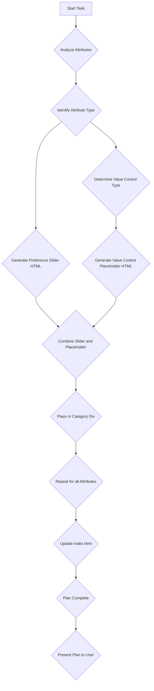

# Filter Control Implementation Plan

This plan outlines the implementation of individual filter controls for each attribute within the expandable filter menu in `index.html`, based on the attribute types defined in `data/template.json5`.

## Goals:

1.  Implement a reusable preference level slider once for all attributes.
2.  Define a reusable structure for each different type of value control based on attribute type.
3.  Update the HTML structure in `index.html` to include the preference slider and dynamic value controls.
4.  Exclude value filters for general string attributes (name, description, website, based_on).

To avoid unecessarily long codefiles, we define each slider and value control once, and call it every time the attribute requires it. (Each attribute requires 1 preference slider and 1 value filter control) Each attribute value is used to be able to filter the table according to the user preference (e.g. if he checks the box show non-negotiable match only, etc...) and for the algorithmic matchmaking.


## Detailed Steps:

1.  **Preference Level Slider:**
    *   Replace the current preference level dropdowns with a single, reusable HTML structure for a slider input (`<input type="range">`).
    *   The slider will have a `min` value of 0 and a `max` value of 4.
    *   Map the slider values to preference levels:
        *   0: Don't show
        *   1: Don't care
        *   2: Nice-to-have
        *   3: Important
        *   4: Non-negotiable
    *   This slider will be included for every filterable attribute.

2.  **Value Control Structures:**
    *   Define conceptual HTML structures or identify how JavaScript will dynamically generate the appropriate value control based on the attribute's data type.
    *   **Numbers:** Slider input (`<input type="range">`) with `min`, `max`, and `step` attributes determined by the specific attribute's range (e.g.appropriate range for numbers based on data analysis).
    *   **1-10 scales:** Slider input (`<input type="range">`) with `min`, `max`, and `step` attributes determined by the 1-10 scale.
    *   **Booleans:** Checkbox input (`<input type="checkbox">`).
    *   **Arrays and specific string values:** Multi-select dropdown (`<select multiple>`) or a series of checkboxes. The options will need to be populated dynamically based on the possible values found in the data.
    *   **General Strings (name, description, website, based_on):** No specific value control will be implemented for filtering based on content. Only the preference level slider will be included for these attributes.

3.  **Update `index.html` Structure:**
    *   Locate the `.detailed-filters` section in `index.html`.
    *   Within each `.filter-category` and its `.filter-placeholder` div, structure each attribute's controls as follows:
        ```html
        <div class="filter-attribute" data-attribute="attribute_name" data-type="attribute_type">
            <label for="attribute_name-pref">Attribute Name:</label>
            <!-- Reusable Preference Level Slider -->
            <input type="range" id="attribute_name-pref" class="preference-level-slider" min="0" max="4" value="1">
            <!-- Placeholder for Value Control (to be populated by JS) -->
            <div class="attribute-value-control">
                <!-- Specific control (slider, checkbox, select) will be dynamically inserted here by JavaScript -->
            </div>
        </div>
        ```
    *   The `data-attribute` and `data-type` attributes will be crucial for JavaScript to identify the attribute and render the correct value control.
    *   For the "General Info" category attributes (name, description, website, based_on), the `.attribute-value-control` div will remain empty in the initial HTML structure.

4.  **Refine Attribute List and Types:**
    *   Review the attributes from `data/template.json5` and categorize them by type (Number/Scale, Boolean, Array/Specific String, General String) to ensure the correct `data-type` is assigned in the HTML structure.

## Next Steps (after HTML structure is updated):

*   Implement JavaScript to dynamically render the appropriate value controls based on the `data-type` attribute.
*   Implement JavaScript to handle the logic for filtering the distribution data based on the selected preference levels and value control inputs.
*   Integrate the filter controls with the table display to show only matching distributions.

## Visual Representation (Mermaid Diagram):



This plan provides a structured approach to implementing the filter controls efficiently and maintainably, addressing the feedback provided.