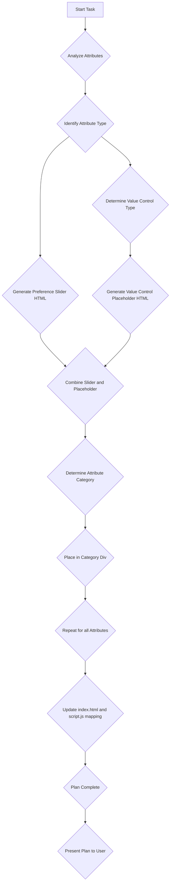

# Filter Control Implementation Plan

This plan outlines the implementation of individual filter controls for each attribute within the expandable filter menu in `index.html`, based on the attribute types defined in `data/template.json5`. The filter categories have been reorganized to be more descriptive and user-centric, moving away from fixed priority levels.

## Goals:

1.  Implement a reusable preference level slider once for all attributes.
2.  Define a reusable structure for each different type of value control based on attribute type.
3.  Update the HTML structure in `index.html` to include the preference slider and dynamic value controls, organized by new descriptive categories.
4.  Exclude value filters for general string attributes (name, description, website).

To avoid unecessarily long codefiles, we define each slider and value control once, and call it every time the attribute requires it. (Each attribute requires 1 preference slider and 1 value filter control) Each attribute value is used to be able to filter the table according to the user preference (e.g. if he checks the box show non-negotiable match only, etc...) and for the algorithmic matchmaking.

## Detailed Steps:

1.  **Preference Level Slider:**
    *   Replace the current preference level dropdowns with a single, reusable HTML structure for a slider input (`<input type="range">`).
    *   The slider will have a `min` value of 0 and a `max` value of 4.
    *   Map the slider values to preference levels:
        *   0: Don't show
        *   1: Don't care
        *   2: Nice-to-have
        *   3: Important
        *   4: Non-negotiable
    *   This slider will be included for every filterable attribute.

2.  **Value Control Structures:**
    *   Define conceptual HTML structures or identify how JavaScript will dynamically generate the appropriate value control based on the attribute's data type.
    *   **Numbers:** Slider input (`<input type="range">`) with `min`, `max`, and `step` attributes determined by the specific attribute's range (e.g.appropriate range for numbers based on data analysis).
    *   **1-10 scales:** Slider input (`<input type="range">`) with `min`, `max`, and `step` attributes determined by the 1-10 scale.
    *   **Booleans:** Custom UI switch (`<div>` with classes) to represent true/false.
    *   **Arrays and specific string values:** Multi-select dropdown (`<select multiple>`) or a series of checkboxes. The options will need to be populated dynamically based on the possible values found in the data.
    *   **General Strings (name, description, website):** No specific value control will be implemented for filtering based on content. Only the preference level slider will be included for these attributes.

3.  **Update `index.html` Structure:**
    *   Locate the `.detailed-filters` section in `index.html`.
    *   Replace the old priority-based filter category divs with new ones based on the attribute groupings in `data/template.json5`.
    *   Within each new `.filter-category` and its `.filter-placeholder` div, structure each attribute's controls as follows:
        ```html
        <div class="filter-attribute" data-attribute="attribute_name" data-type="attribute_type">
            <label for="attribute_name-pref">Attribute Name:</label>
            <!-- Reusable Preference Level Slider -->
            <input type="range" id="attribute_name-pref" class="preference-level-slider" min="0" max="4" value="1">
            <!-- Placeholder for Value Control (to be populated by JS) -->
            <div class="attribute-value-control">
                <!-- Specific control (slider, checkbox, select) will be dynamically inserted here by JavaScript -->
            </div>
        </div>
        ```
    *   The `data-attribute` and `data-type` attributes will be crucial for JavaScript to identify the attribute and render the correct value control.
    *   For the "General Info" category attributes (name, description, website), the `.attribute-value-control` div will remain empty in the initial HTML structure.

4.  **Refine Attribute List and Categories:**
    *   Review the attributes from `data/template.json5` and categorize them by type (Number/Scale, Boolean, Array/Specific String, General String) and assign them to the appropriate new descriptive categories (e.g., System Requirements, Security & Privacy, Performance Metrics, etc.) to ensure the correct `data-type` is assigned in the HTML structure and they are placed in the correct category placeholder div by JavaScript.

## Next Steps (after HTML structure and script mapping are updated):

*   Implement JavaScript to dynamically render the appropriate value controls based on the `data-type` attribute. (Already partially implemented)
*   Implement JavaScript to handle the logic for filtering the distribution data based on the selected preference levels and value control inputs. This logic will now prioritize filtering by detailed attribute values first, and then apply summary filters (Non-Negotiable, Important, Nice-to-Have) based on whether a distribution meets *all* criteria marked with that specific priority level by the user. (Already partially implemented)
*   Integrate the filter controls with the table display to show only matching distributions.

## Visual Representation (Mermaid Diagram - Rendering):



## Visual Representation (Mermaid Diagram - Filtering Logic):

```mermaid
graph TD
    A[Start with All Distros] --> B{Eliminate Manually Hidden Distros};
    B --> C[Initial Filterable List];

    subgraph Detailed Attribute Filtering
        C --> D{For each attribute (e.g., Secure Boot, RAM)}
        D -- User sets value (e.g., Yes, >=8GB) and Priority (e.g., Important) --> E[Apply Value Filter based on user input];
        E --> F[List filtered by detailed values];
    end

    F --> G{Non-Negotiable Summary Checkbox Checked?};
    G -- Yes --> H{Filter `valueFilteredList`: Distro must meet ALL criteria user marked "Non-negotiable" with their set values};
    G -- No --> I[List remains as is];
    H --> I;

    I --> J{Important Summary Checkbox Checked?};
    J -- Yes --> K{Filter Current List: Distro must meet ALL criteria user marked "Important" with their set values};
    J -- No --> L[List remains as is];
    K --> L;

    L --> M{Nice-to-Have Summary Checkbox Checked?};
    M -- Yes --> N{Filter Current List: Distro must meet ALL criteria user marked "Nice-to-Have" with their set values};
    M -- No --> O[List remains as is];
    N --> O;

    O --> P[Final Filtered List for Display];