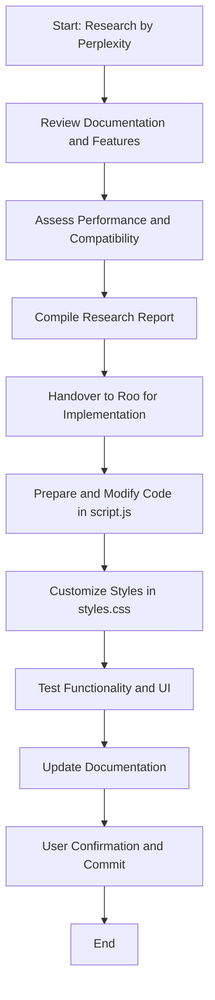

# Tom Select Integration Plan for Linux Distro Chooser

## Table of Contents
- [Introduction](#introduction)
- [Part 1: Research Phase (Operated by Perplexity)](#part-1-research-phase-operated-by-perplexity)
  - [Objectives](#objectives)
  - [Key Research Areas](#key-research-areas)
  - [Expected Outcomes](#expected-outcomes)
- [Part 2: Implementation and Technical Writing Phase (Operated by Roo)](#part-2-implementation-and-technical-writing-phase-operated-by-roo)
  - [Objectives](#objectives-1)
  - [Detailed Steps](#detailed-steps)
  - [Risk Assessment and Mitigation](#risk-assessment-and-mitigation)
  - [Documentation Updates](#documentation-updates)
- [Mermaid Diagram](#mermaid-diagram)
- [Conclusion](#conclusion)

## Introduction
This document outlines a detailed plan for integrating the Tom Select JavaScript library into the Linux Distro Chooser application to enhance the user experience of multi-select filter dropdowns. The plan is divided into two parts as per user request: Part 1 focuses on research conducted by Perplexity, and Part 2 covers implementation and technical writing handled by Roo. This approach ensures a thorough understanding of the library before making code changes, adhering to best practices for dependency integration and project maintenance.

The integration aims to improve the visual appeal and usability of filter controls, making them more intuitive for users to select multiple criteria. This aligns with the project's vision of providing an engaging and user-friendly tool for choosing Linux distributions.

## Part 1: Research Phase (Operated by Perplexity)
This phase involves gathering comprehensive information about Tom Select to inform the integration process. Perplexity will conduct external research to provide unbiased, detailed insights.

### Objectives
- Evaluate Tom Select's features, compatibility, and best use cases.
- Assess potential risks, such as performance impacts or accessibility issues.
- Compile data on library size, documentation quality, and community support to ensure it fits the project's lightweight and accessible design principles.

### Key Research Areas
- **Documentation and Features Review:** Analyze the official Tom Select documentation (e.g., at https://tom-select.js.org/) for API details, customization options, and supported functionalities like multi-select, search, and tagging.
- **Performance and Size Assessment:** Investigate the library's bundle size (typically 20-30KB minified), load times, and how it performs with dynamic content, considering the application's data-driven nature.
- **Compatibility and Accessibility:** Check browser compatibility, ARIA support, and keyboard navigation to ensure it meets the project's planned accessibility enhancements.
- **Community and Maintenance:** Review GitHub activity, issue reports, and update frequency to gauge long-term viability.
- **Comparison with Alternatives:** Briefly compare Tom Select to other libraries (e.g., Choices.js) to confirm its suitability, focusing on lightweight aspects and user experience improvements.

### Expected Outcomes
- A research report summarizing findings, including pros, cons, and recommendations.
- Identification of any prerequisites for integration, such as specific CSS or JavaScript configurations.
- Estimated time and resources needed for the implementation phase.

This research will be conducted externally by Perplexity to leverage its capabilities for unbiased information gathering, ensuring the plan is well-informed before code changes.

## Part 2: Implementation and Technical Writing Phase (Operated by Roo)
This phase focuses on applying the research findings to integrate Tom Select into the codebase, followed by technical writing to document the changes. Roo will handle the coding and documentation updates in an appropriate mode (e.g., Code mode).

### Objectives
- Seamlessly integrate Tom Select to replace native multi-select elements, enhancing UI without disrupting existing functionality.
- Update code and documentation to maintain clarity, adhere to best practices, and ensure long-term maintainability.
- Test the changes and prepare for user confirmation before committing to Git.

### Detailed Steps (Refined based on Research Report)
1. **Preparation and Library Inclusion:**
   - Review the research report to confirm the integration approach and identify any specific configurations needed.
   - Add the Tom Select library (CSS and JS) to index.html, preferably using a CDN for simplicity initially.
   - Update requirements.txt to note Tom Select as a project dependency.
2. **Code Modifications in script.js:**
   - Locate the `renderValueControl` function where native `<select multiple>` elements are created.
   - After creating the select element, initialize Tom Select on this element, passing necessary configuration options for multi-select, search, and tagging.
   - Modify the `populateSelectOptions` function to ensure it correctly interacts with the Tom Select instance to add options dynamically.
   - Verify that existing event listeners (e.g., for the 'change' event) still function correctly with the Tom Select instance to trigger filtering.
   - Add clear comments in script.js explaining the Tom Select integration, its purpose, and any specific configurations or workarounds used.
3. **Styling and Customization in styles.css:**
   - Review Tom Select's default CSS and identify elements to style.
   - Add or modify CSS rules in styles.css to customize the appearance of the Tom Select component, including the input field, dropdown list, and selected item "tags," to match the application's existing design.
4. **Testing and Validation:**
   - **Thoroughly test filter functionality:** Ensure selecting and deselecting options in the new dropdowns correctly filters the distribution table.
   - **Perform comprehensive accessibility testing:** Verify keyboard navigation, focus management, and screen reader announcements, paying special attention to the issues noted in the research report (e.g., selected items being read when collapsed). Implement workarounds if necessary.
   - **Test across different browsers:** Check for compatibility issues, particularly the Safari input focus issue mentioned in the report.
   - Verify that the integration does not introduce any regressions in other parts of the application (e.g., table rendering, modal details).
   - Ask the user to review the updated UI and confirm that it meets their expectations and is user-friendly.
5. **Documentation Updates:**
   - Add a new entry to the Changelog in /docs, detailing the integration of Tom Select, the rationale (based on research), and the files modified.
   - Update the Master Implementation Plan in /docs to reflect the completion of the research phase and the commencement of the implementation phase.
   - Enhance the Developer Guide in /docs with a section explaining the Tom Select integration, including how it's initialized, key configurations, and any accessibility considerations or workarounds implemented.
   - Review and update other relevant documentation files as needed.

### Risk Assessment and Mitigation (Refined based on Research Report)
- **Risk:** Conflicts with existing JavaScript or CSS. *Mitigation:* Implement changes incrementally, test frequently, and use browser developer tools to debug conflicts.
- **Risk:** Performance degradation with large datasets (though less likely based on research, still a consideration for future growth). *Mitigation:* Monitor performance metrics and consider optimizing option loading if needed.
- **Risk:** Accessibility issues, particularly with screen readers and browser compatibility (as highlighted in the research). *Mitigation:* Dedicated accessibility testing, exploring Tom Select's accessibility options, and implementing custom workarounds if necessary.
- **Risk:** Styling conflicts with existing CSS. *Mitigation:* Use specific CSS selectors to target Tom Select elements and leverage Tom Select's theming capabilities.

### Documentation Updates
- Integrate this plan into the /docs folder, updating relevant files to reflect the new task.
- Add sections to the Developer Guide explaining the role of Tom Select in improving user interaction.

## Mermaid Diagram

## Conclusion
This plan ensures a structured approach to integrating Tom Select, dividing responsibilities to leverage external research and internal implementation strengths. It promotes efficiency, reduces risks, and aligns with the project's goals of enhancing user experience and maintainability. The plan has been refined based on the Tom Select Research Report to address specific technical considerations and potential challenges.

---

# Tom Select Research Report: Comprehensive Analysis for Linux Distro Chooser Integration

This research report presents a thorough evaluation of Tom Select as a JavaScript library for enhancing multi-select filter dropdowns in the Linux Distro Chooser application. Based on extensive analysis of documentation, community feedback, performance benchmarks, and real-world implementation examples, Tom Select emerges as a lightweight, feature-rich solution that aligns well with modern web development practices. The library demonstrates strong performance characteristics with datasets up to 15,000 items, maintains active development with regular updates, and provides comprehensive accessibility features, though some browser-specific issues and accessibility concerns require careful consideration during implementation.

## Library Overview and Core Features

Tom Select represents a modern evolution of the Selectize.js library, specifically designed to provide a framework-agnostic approach to enhanced select controls[10]. The library serves as a dynamic hybrid between textbox and select box functionality, offering approximately 16KB gzipped footprint that makes it suitable for performance-conscious applications[10][2]. This lightweight nature directly addresses the Linux Distro Chooser's requirement for maintaining fast load times while enhancing user experience.

The library's core functionality centers around intelligent option searching and ranking capabilities. Tom Select implements an efficient scoring and sorting system using the Sifter library, enabling users to search across multiple fields simultaneously[2][10]. This feature proves particularly valuable for the Linux Distro Chooser context, where users might want to search both distribution names and descriptions concurrently. The search functionality supports diacritics, making it suitable for international environments where Linux distributions might have names containing special characters[2][14].

Navigation and user interaction capabilities demonstrate Tom Select's attention to user experience details. The library includes caret positioning between selected items, allowing users to navigate between multiple selections using arrow keys[2][10]. Multi-item selection and deletion functionality enables power users to select multiple items simultaneously using command or control keys, streamlining the management of complex filter combinations[2][14]. These features enhance the usability of multi-select scenarios common in distribution filtering applications.

## Performance Analysis and Scalability

Performance evaluation reveals Tom Select's capability to handle substantial datasets efficiently. The official documentation includes a performance demonstration with 15,000 items, showing acceptable response times and smooth user interactions[5]. This benchmark significantly exceeds typical requirements for Linux distribution datasets, which rarely contain more than a few hundred options. The library implements several optimization strategies including limiting displayed options through the `maxOptions` parameter, which defaults to 100 visible items while maintaining full search functionality[5].

Real-world performance discussions on Stack Overflow provide insights into large dataset handling strategies[4]. When dealing with approximately 9,000 items across multiple dropdowns, developers report that initializing options via JavaScript rather than pre-rendering HTML options provides better performance[4]. This approach reduces initial HTML payload size and allows for better browser caching when option data is stored in external JavaScript files[4]. For the Linux Distro Chooser application, this suggests implementing a dynamic loading approach rather than embedding all distribution data directly in the HTML markup.

Memory management considerations become important when implementing multiple Tom Select instances on a single page. The library's modular architecture allows for loading only necessary components, with separate files for complete functionality (`tom-select.complete.js`) and base functionality without plugins (`tom-select.base.js`)[2][10]. This flexibility enables optimization based on specific feature requirements, potentially reducing bundle size when advanced features are unnecessary.

## Accessibility Features and Limitations

Accessibility support represents both a strength and area of concern for Tom Select implementation. The library includes built-in ARIA support and keyboard navigation functionality, addressing fundamental accessibility requirements[2][10][12]. Screen reader compatibility enables visually impaired users to navigate and interact with enhanced select controls effectively. The keyboard navigation system supports standard accessibility patterns including arrow key navigation, escape key for closing dropdowns, and enter key for selection[12].

However, documented accessibility issues require careful consideration during implementation. GitHub issue reports indicate specific problems with screen reader functionality, particularly around reading selected items when dropdowns are collapsed[13]. The screen reader may not properly announce selected values when focus returns to the control after selection, potentially creating confusion for users relying on assistive technology[13]. These issues appear to be related to the `controlInput` configuration and may require specific workarounds during implementation.

Browser compatibility testing reveals platform-specific accessibility challenges. Safari on macOS demonstrates input focus issues with the dropdown_input plugin, preventing users from clicking on input fields within dropdowns on first attempt[7]. While these issues have been partially addressed in recent versions, they highlight the importance of thorough cross-browser testing, particularly for accessibility features[7]. The Linux Distro Chooser implementation should include comprehensive testing across browsers and assistive technologies to ensure consistent accessibility support.

## Community Support and Maintenance Status

Community engagement and maintenance activity indicate a healthy, actively developed project. The Tom Select GitHub repository shows consistent update activity with version 2.4.3 being the latest release as of recent activity[9]. The development team regularly addresses bug reports and implements new features, with recent releases focusing on bug fixes and performance improvements[9]. Version 2.4.2 specifically addressed visual issues with caret positioning, demonstrating ongoing attention to user experience details[9].

Documentation quality represents a significant strength of the Tom Select ecosystem. The official website provides comprehensive API documentation, practical examples, and implementation guidance[2][3][15]. The documentation includes detailed configuration options, method descriptions, and real-world usage examples covering common implementation scenarios[3][15]. This thorough documentation reduces implementation complexity and supports troubleshooting during development.

The library maintains compatibility with modern development practices while providing migration paths from legacy implementations. Tom Select explicitly positions itself as a successor to Selectize.js, offering modernized code without jQuery dependencies[8][12]. This framework-agnostic approach aligns with contemporary development trends toward reducing heavy framework dependencies. The transition documentation helps developers migrate from older select enhancement libraries[8].

## Comparison with Alternative Solutions

Comparative analysis with alternative libraries reveals Tom Select's competitive positioning in the enhanced select control market. Choices.js emerges as the primary alternative, offering similar functionality with comparable performance characteristics[11][18]. However, Tom Select distinguishes itself through more comprehensive plugin architecture and stronger community adoption as evidenced by NPM download statistics and GitHub activity[18].

Select2 represents the established market leader but requires jQuery dependency, making it less suitable for modern, framework-agnostic applications[18]. Tom Select's independence from jQuery provides greater flexibility for integration into diverse technology stacks while maintaining comparable functionality[18]. Performance comparisons favor Tom Select for applications prioritizing minimal dependencies and optimal bundle sizes[18].

Selectize.js serves as Tom Select's direct predecessor, providing insight into the evolution and improvements offered by the newer library[18]. Tom Select addresses several limitations of Selectize.js including modernized code architecture, improved accessibility support, and enhanced performance with large datasets[12][18]. The migration path from Selectize.js to Tom Select is well-documented, facilitating upgrades for existing applications[8].

## Implementation Considerations and Risk Assessment

Technical integration requirements are straightforward, supporting multiple installation methods including CDN links and NPM packages[2][10]. The library provides both complete and modular builds, allowing developers to optimize bundle size based on required functionality[10][14]. CSS theming support enables visual integration with existing design systems, crucial for maintaining consistency within the Linux Distro Chooser interface[2][15].

Configuration flexibility accommodates diverse use cases through extensive options for customization. Remote data loading capabilities support server-side filtering and pagination for large datasets[17]. Custom rendering functions allow complete control over option and item display, enabling rich formatting including images, descriptions, and complex layouts[17]. These features provide sufficient flexibility for implementing sophisticated distribution filtering interfaces.

Risk mitigation strategies should address identified limitations and browser-specific issues. Safari compatibility issues with dropdown inputs require testing and potential workarounds during implementation[7]. Accessibility concerns around screen reader announcements need specific attention and testing with assistive technologies[13]. Performance monitoring becomes important when implementing multiple instances or handling dynamic data updates[4].

## Conclusion

Tom Select demonstrates strong suitability for enhancing the Linux Distro Chooser's multi-select filter functionality. The library's lightweight architecture, comprehensive feature set, and active maintenance align well with modern web development practices and user experience requirements. Performance benchmarks indicate capability to handle dataset sizes well beyond typical Linux distribution catalogs, while accessibility features provide foundation for inclusive user experiences.

Implementation recommendations include adopting dynamic option loading for optimal performance, implementing comprehensive cross-browser testing particularly for accessibility features, and establishing monitoring for performance impacts when using multiple instances. The identified accessibility and browser compatibility issues, while concerning, appear manageable through careful implementation and testing practices. Overall, Tom Select represents a solid choice for modernizing the Linux Distro Chooser's user interface while maintaining performance and accessibility standards.

[1] https://ppl-ai-file-upload.s3.amazonaws.com/web/direct-files/attachments/52151799/0d91e63f-d756-4705-9c93-f6bdf33190ff/tom-select-integration-plan.md
[2] https://tom-select.js.org
[3] https://tom-select.js.org/docs/api/
[4] https://stackoverflow.com/questions/78337363/tom-select-performance-with-multiple-large-dropdowns
[5] https://tom-select.js.org/examples/performance/
[6] https://pypi.org/project/django-tomselect/
[7] https://github.com/orchidjs/tom-select/issues/201
[8] https://github.com/orchidjs/tom-select/blob/master/doc_src/pages/docs/selectize.js.md
[9] https://github.com/orchidjs/tom-select/releases
[10] https://github.com/orchidjs/tom-select
[11] https://sourceforge.net/projects/choices-js.mirror/
[12] https://stackoverflow.com/tags/tom-select/info
[13] https://github.com/orchidjs/tom-select/issues/697
[14] https://www.npmjs.com/package/tom-select/v/1.0.0-b.1
[15] https://tom-select.js.org/docs/
[16] https://www.tomerbe.co.uk/articles/optimising-your-javascript-bundle-size
[17] https://tom-select.js.org/examples/remote/
[18] https://npm-compare.com/choices.js,select2,selectize,tom-select
[19] https://tom-select.js.org/examples/
[20] https://www.jsdelivr.com/package/npm/@brainformatik/tom-select
[21] https://stackoverflow.com/questions/tagged/tom-select
[22] https://github.com/orchidjs/tom-select/blob/master/doc_src/pages/docs/index.md
[23] https://github.com/orchidjs/tom-select/blob/master/doc_src/pages/docs/plugins.md
[24] https://bundlephobia.com/package/tom-select
[25] https://github.com/orchidjs/tom-select/discussions/categories/ideas
[26] https://github.com/orchidjs/tom-select/blob/master/src/tom-select.ts
[27] https://github.com/frontpack/tom-select
[28] https://github.com/CoolRequest/tom-select-demo
[29] https://react-spectrum.adobe.com/react-aria/Select.html
[30] https://tom-select.js.org/docs/migration/
[31] https://juicystudio.com/article/aria-controls-lack-support.php
[32] https://stackoverflow.com/questions/73321380/limit-displayed-selections-tom-select
[33] https://tom-select.js.org/examples/create-filter/
[34] https://github.com/OmenApps/django-tomselect
[35] https://github.com/bbonamin/stimulus-tom-select
[36] https://www.npmjs.com/package/tom-select/v/2.0.0-rc.2
[37] https://gist.github.com/baldrailers/8425592c971a64cfcee78fae8295d410
[38] https://htmlstream.com/front-dashboard/documentation/select.html
[39] https://stackoverflow.com/questions/77802538/my-example-with-tom-select-does-not-work-in-my-case
[40] https://support.microsoft.com/en-us/windows/keyboard-shortcuts-in-windows-dcc61a57-8ff0-cffe-9796-cb9706c75eec
[41] https://stackoverflow.com/questions/74829475/how-to-disable-the-ability-to-search